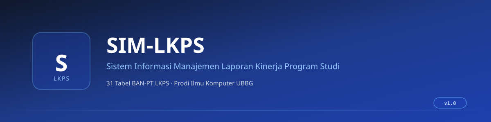

<!-- banner -->
<p align="center">
  
</p>

<p align="center">
  <strong>Sistem Informasi Manajemen Laporan Kinerja Program Studi</strong><br>
  Web app untuk 31 tabel BAN-PT LKPS, Prodi Ilmu Komputer UBBG
</p>

<p align="center">
  <a href="#-quick-start">Quick Start</a> ·
  <a href="https://github.com/axolotl-void/SIM-LKPS/issues">Report Bug</a> ·
  <a href="https://github.com/axolotl-void/SIM-LKPS/security">Security</a>
</p>

<br>

<p align="center">
  
  
  
  
  
  
  
  
  
</p>

<br>

## Highlights

- **31 Tabel BAN-PT** sesuai format LKPS, mencakup semua BAB (Tata Pamong, Pendidikan, Penelitian, Pengabdian, Tata Kelola, Visi Misi)
- **4 Role Terpisah** dengan permission matrix granular: Admin, Operator, Validator, Pimpinan
- **Workflow Validasi** lengkap: Draft ke Diajukan ke Disetujui atau Ditolak atau Direvisi dengan komentar validator
- **Evidence Management** ke Cloudflare R2 (S3-compatible), support upload file dan link URL eksternal
- **Dashboard Progress** visual per BAB plus notifikasi real-time
- **Export Excel, Word, PDF** untuk laporan siap akreditasi
- **Audit Log** untuk setiap mutasi dan login atau logout
- **Responsive** di desktop, tablet, dan HP (minimal 375px)

## Arsitektur

```
┌────────────────────────────────────────────────────────┐
│  Browser (Dosen / Operator / Admin / Validator)        │
└─────────────────────┬──────────────────────────────────┘
                      │ HTTPS
                      ▼
        ┌─────────────────────────────────────┐
        │   Vercel (Next.js 15 App Router)    │
        │   • Server Components               │
        │   • Server Actions                  │
        │   • Route Handlers                  │
        └─────┬──────────────────┬────────────┘
              │                  │
              ▼                  ▼
   ┌────────────────────┐  ┌──────────────────┐
   │  Neon Postgres     │  │  Cloudflare R2   │
   │  (PostgreSQL 16)   │  │  (Evidence Files)│
   └────────────────────┘  └──────────────────┘
              ▲                  ▲
              └──────────────────┘
                  Auth.js v5 (JWT)
```

## Tech Stack

| Layer | Technology |
|-------|------------|
| Framework | Next.js 15 (App Router), React 19 |
| Language | TypeScript 5.6 (strict) |
| Database | PostgreSQL 16 (Neon production, lokal dev) |
| ORM | Prisma 6 |
| Auth | Auth.js v5 (NextAuth), JWT strategy |
| Storage | Cloudflare R2 (production), MinIO (dev lokal) |
| UI | Tailwind CSS v4, shadcn/ui, Framer Motion |
| Validation | Zod, React Hook Form |
| Export | ExcelJS, docx, pdfkit |
| Testing | Vitest (unit), Playwright (E2E) |
| Deploy | Vercel |

## Project Structure

```
sim-lkps/
├── app/                       # Next.js App Router
│   ├── (auth)/                # Login page (centered gradient)
│   ├── (dashboard)/           # Authenticated pages (sidebar)
│   │   ├── dashboard/
│   │   ├── lkps/              # 31 tabel per BAB
│   │   ├── master/            # Prodi, Dosen, Tendik, Mahasiswa, MK
│   │   ├── evidence/
│   │   ├── laporan/           # Export Excel/Word/PDF
│   │   └── settings/
│   └── api/                   # Route handlers
├── components/
│   ├── forms/                 # React Hook Form + Zod
│   ├── layout/                # Sidebar, header, breadcrumb
│   ├── tables/                # 31 LKPS table client components
│   └── ui/                    # shadcn/ui primitives
├── lib/
│   ├── actions/               # Server Actions
│   ├── auth.ts                # Auth.js config
│   ├── db.ts                  # Prisma singleton
│   └── validations/           # Zod schemas
├── prisma/
│   ├── schema.prisma          # 13 models (User + 6 master + LKPS)
│   └── seed.ts                # Seed data
├── tests/                     # Vitest + Playwright
├── docs/                      # Sprint docs, API contract
├── docker-compose.yml         # PostgreSQL + MinIO (lokal)
└── .github/assets/            # Banner, screenshots, GIF
```

## Quick Start

### Prasyarat

- Node.js >= 20 LTS
- Akun Neon (gratis) atau PostgreSQL lokal
- Akun Cloudflare (opsional, bisa skip kalau pakai MinIO lokal)

### 1. Clone dan Install

```bash
git clone https://github.com/axolotl-void/SIM-LKPS.git
cd SIM-LKPS
npm install
```

### 2. Setup Environment

```bash
cp .env.example .env
# Edit .env, isi DATABASE_URL, AUTH_SECRET (openssl rand -base64 32), R2 credentials
```

### 3. Setup Database

```bash
npx prisma generate
npx prisma db push
npm run db:seed
```

### 4. Run Dev Server

```bash
npm run dev
```

Buka [http://localhost:3000](http://localhost:3000).

### 5. Build Production

```bash
npm run build
npm run start
```

## Demo Credentials

| Role | Email | Password |
|------|-------|----------|
| Admin | `admin@ubbg.ac.id` | `Admin@2026!` |
| Operator | `operator@ubbg.ac.id` | `Operator@2026!` |
| Validator | `validator@ubbg.ac.id` | `Validator@2026!` |
| Pimpinan | `pimpinan@ubbg.ac.id` | `Pimpinan@2026!` |

> Ganti semua password setelah deploy ke production. Password default hanya untuk demo skripsi.

## 31 Tabel LKPS

| BAB | Jumlah | Tabel |
|-----|--------|-------|
| BAB 1, Tata Pamong | 6 | 1.A.1, 1.A.2, 1.A.3, 1.A.4, 1.A.5, 1.B |
| BAB 2, Pendidikan | 11 | 2.A.1, 2.A.2, 2.A.3, 2.B.1, 2.B.2, 2.B.3, 2.B.4, 2.B.5, 2.B.6, 2.C, 2.D |
| BAB 3, Penelitian | 6 | 3.A.1, 3.A.2, 3.A.3, 3.C.1, 3.C.2, 3.C.3 |
| BAB 4, Pengabdian | 5 | 4.A.1, 4.A.2, 4.C.1, 4.C.2, 4.C.3 |
| BAB 5, Tata Kelola | 2 | 5.1, 5.2 |
| BAB 6, Visi Misi | 1 | 6 |
| **Total** | **31** | |

## Development

```bash
npm run dev          # Dev server
npm run build        # Production build
npm run lint         # ESLint
npm run format       # Prettier write
npm run type-check   # TypeScript check
npm run db:push      # Prisma db push
npm run db:seed      # Seed database
npm run db:studio    # Prisma Studio
npm run test         # Vitest unit tests
npm run test:e2e     # Playwright E2E
```

## Roles dan Permissions

| Feature | Admin | Operator | Validator | Pimpinan |
|---------|:-----:|:--------:|:---------:|:--------:|
| Dashboard | Ya | Ya | Ya | Ya |
| Master Data CRUD | Ya | Tidak | Tidak | Tidak |
| Input Tabel LKPS | Ya | Ya | Tidak | Tidak |
| Submit Tabel | Tidak | Ya | Tidak | Tidak |
| Validasi Tabel | Tidak | Tidak | Ya | Tidak |
| Export Laporan | Ya | Ya | Ya | Ya |
| Settings | Ya | Tidak | Tidak | Tidak |

## License

Proprietary. Copyright (c) 2026 Yogi Prasetya Sadewa, Universitas Bina Bangsa Getsempena.

Skripsi project, tidak untuk distribusi komersial tanpa izin.

## Credits

- **LAM INFOKOM**, format 31 tabel LKPS dan dokumen akreditasi
- **BAN-PT**, standar Instrumen Suplemen Konversi
- **Universitas Bina Bangsa Getsempena**, studi kasus dan data pengujian
- **shadcn/ui, Prisma, Auth.js, Vercel, Cloudflare**, tooling open-source

---

<p align="center">Made for Prodi Ilmu Komputer UBBG</p>
