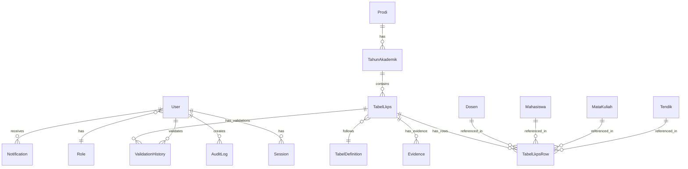

# SIM-LKPS — Database Design

**Versi:** 1.0  
**Sprint:** 0  
**Agent:** CTO Agent  
**Tanggal:** 2026-07-16  
**Status:** DRAFT → IN REVIEW

---

## 1. ERD — Conceptual Model



---

## 2. Core Entities

### 2.1 Authentication & Users

| Entitas | Deskripsi | Relasi |
|---------|-----------|--------|
| **User** | Pengguna sistem (email, password hash, role) | has Role, has Sessions |
| **Role** | Enum: ADMIN, OPERATOR, VALIDATOR, PIMPINAN | — |
| **Session** | Session Auth.js (token, expires) | belongs to User |
| **Account** | OAuth account data (Auth.js) | belongs to User |
| **AuditLog** | Log aktivitas (who, what, when, old/new value) | belongs to User |

### 2.2 Master Data

| Entitas | Deskripsi | Key Fields |
|---------|-----------|------------|
| **Prodi** | Program Studi | nama, jenjang, kode, fakultas |
| **TahunAkademik** | Tahun akademik + semester | tahun, semester, is_active |
| **Dosen** | Data dosen tetap/tidak tetap | nidn, nama, jabatan_fungsional, pendidikan_terakhir, status |
| **Tendik** | Tenaga kependidikan | nip, nama, jabatan, pendidikan_terakhir, status |
| **Mahasiswa** | Data mahasiswa | nim, nama, angkatan, status, jenis_kelamin |
| **MataKuliah** | Mata kuliah | kode, nama, sks, semester, kategori |

### 2.3 Tabel LKPS

| Entitas | Deskripsi | Key Fields |
|---------|-----------|------------|
| **TabelDefinition** | Definisi 31 tabel LKPS (metadata) | kode (1.A.1), nama, bab, kolom_definitions (JSON) |
| **TabelLkps** | Instance tabel per tahun akademik | tabel_definition_id, tahun_akademik_id, status, submitted_by, validated_by |
| **TabelLkpsRow** | Baris data dalam tabel | tabel_lkps_id, row_data (JSON), row_order |
| **Evidence** | Bukti pendukung (file upload) | tabel_lkps_id, filename, minio_key, mime_type, size, version |

### 2.4 Workflow

| Entitas | Deskripsi | Key Fields |
|---------|-----------|------------|
| **ValidationHistory** | Riwayat validasi per tabel | tabel_lkps_id, user_id, action (SUBMIT/APPROVE/REJECT/REVISE), comment, timestamp |
| **Notification** | Notifikasi in-app | user_id, title, message, type, is_read, link |

---

## 3. Status Flow — Tabel LKPS

```
┌─────────┐    submit    ┌───────────┐    approve    ┌───────────┐
│  DRAFT  │─────────────▶│  DIAJUKAN │──────────────▶│ DISETUJUI │
└─────────┘              └───────────┘               └───────────┘
     ▲                        │                            
     │                        │ reject                     
     │                        ▼                            
     │                   ┌───────────┐                     
     └───────────────────│  DITOLAK  │                     
        (edit & resave)  └───────────┘                     
                              │                            
                              │ revise                     
                              ▼                            
                         ┌───────────┐                     
                         │  DIREVISI │──── resubmit ──────▶ DIAJUKAN
                         └───────────┘                     
```

**Status enum:**
```typescript
enum TabelStatus {
  DRAFT = "DRAFT",           // Belum disubmit
  DIAJUKAN = "DIAJUKAN",    // Sudah disubmit, menunggu review
  DIREVISI = "DIREVISI",    // Dikembalikan untuk perbaikan
  DISETUJUI = "DISETUJUI",  // Validator menyetujui
  DITOLAK = "DITOLAK",      // Validator menolak
}
```

---

## 4. Kolom Definition Strategy

Karena 31 tabel LKPS memiliki kolom yang **berbeda-beda**, kita menggunakan pendekatan **hybrid**:

### Strategi: Definisi Kolom di Database + Data JSON

```typescript
// TabelDefinition — menyimpan metadata kolom
{
  kode: "1.A.1",
  nama: "Pimpinan dan Tupoksi UPPS dan PS",
  bab: 1,
  kolom_definitions: [
    { key: "no", label: "No", type: "number", required: true },
    { key: "nama", label: "Nama", type: "text", required: true },
    { key: "nidn", label: "NIDN", type: "text", required: true, ref: "dosen" },
    { key: "jabatan", label: "Jabatan", type: "text", required: true },
    { key: "tupoksi", label: "Tupoksi", type: "textarea", required: true },
  ]
}

// TabelLkpsRow — menyimpan data per baris
{
  tabel_lkps_id: "...",
  row_order: 1,
  row_data: {
    "no": 1,
    "nama": "Dr. Ahmad Fauzi, M.Kom.",
    "nidn": "0101018901",
    "jabatan": "Dekan",
    "tupoksi": "Memimpin fakultas..."
  }
}
```

**Keunggulan pendekatan ini:**
- ✅ Satu form component generic untuk semua 31 tabel
- ✅ Kolom bisa diupdate tanpa migration database
- ✅ Validasi dinamis berdasarkan `kolom_definitions`
- ✅ Export konsisten karena kolom terdefinisi

**Trade-off:**
- ⚠️ Tidak bisa foreign key langsung ke row_data fields
- ⚠️ Query filtering pada JSON fields lebih lambat
- Mitigasi: Index GIN pada `row_data` untuk search, referensi via separate columns jika perlu

---

## 5. Indexing Strategy

| Table | Index | Type | Purpose |
|-------|-------|------|---------|
| `user` | `email` | UNIQUE | Login lookup |
| `user` | `role` | BTREE | Filter by role |
| `dosen` | `nidn` | UNIQUE | Unique identifier |
| `mahasiswa` | `nim` | UNIQUE | Unique identifier |
| `mata_kuliah` | `kode` | UNIQUE | Unique identifier |
| `tahun_akademik` | `tahun, semester` | UNIQUE | Prevent duplicates |
| `tabel_lkps` | `tabel_definition_id, tahun_akademik_id` | COMPOSITE | Lookup per tabel per TA |
| `tabel_lkps` | `status` | BTREE | Filter by status |
| `tabel_lkps_row` | `tabel_lkps_id` | BTREE | Rows per tabel |
| `tabel_lkps_row` | `row_data` | GIN | JSON search |
| `evidence` | `tabel_lkps_id` | BTREE | Evidence per tabel |
| `audit_log` | `created_at` | BTREE | Time-based query |
| `audit_log` | `user_id` | BTREE | Per-user audit |
| `notification` | `user_id, is_read` | COMPOSITE | Unread notifications |

---

## 6. Seed Data (Sprint 0)

### Admin User
```
email: admin@ubbg.ac.id
password: Admin@2026! (hashed with bcrypt)
role: ADMIN
name: Administrator
```

### Program Studi
```
nama: Ilmu Komputer
jenjang: S1
kode: 55201
fakultas: Fakultas Keguruan dan Ilmu Pendidikan
```

### Tahun Akademik
```
tahun: 2024/2025
semester: Ganjil
is_active: true
```

### Tabel Definitions (31 entries)
All 31 tabel LKPS with their `kolom_definitions` seeded from the BAN-PT format specification.

---

## 7. Backup & Recovery

| Aspect | Strategy |
|--------|----------|
| **Frequency** | Daily automated (cron) + before migration |
| **Method** | `pg_dump --format=custom` |
| **Storage** | Local disk + optional MinIO bucket |
| **Retention** | Keep 30 days of daily backups |
| **Recovery** | `pg_restore --clean` from backup file |
| **Point-in-time** | WAL archiving for critical scenarios (future) |

---

*Dokumen ini dibuat oleh CTO Agent berdasarkan artefak PM Agent.*
