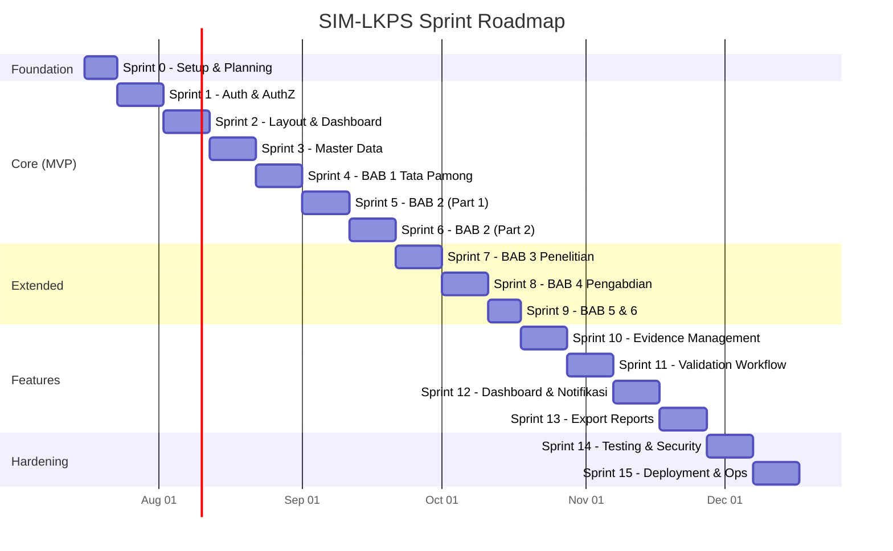

# SIM-LKPS — Roadmap

**Versi:** 1.0  
**Sprint:** 0  
**Agent:** PM Agent  
**Tanggal:** 2026-07-16  
**Status:** DRAFT → IN REVIEW

---

## Sprint Roadmap Overview



---

## Fase & Milestone

### 🏗️ Fase 1: Foundation (Sprint 0)

**Milestone:** Project scaffold siap, bisa `npm run dev`, database connected.

| Sprint | Fokus | Output Kunci | DoD |
|--------|-------|-------------|-----|
| **Sprint 0** | Setup repository, coding standard, environment, CI dasar | Next.js 15 project, Prisma schema, Auth.js config, CI pipeline | Project berjalan tanpa error, lint pass, DB connected |

**Dependency:** Tidak ada dependency sebelumnya.

---

### 🔐 Fase 2: Core MVP (Sprint 1–4)

**Milestone:** User bisa login, lihat dashboard, kelola master data, dan isi tabel BAB 1.

| Sprint | Fokus | Output Kunci | DoD | Dependency |
|--------|-------|-------------|-----|------------|
| **Sprint 1** | Auth & AuthZ | Login, logout, role, permission, session, audit log | 4 role berfungsi, permission teruji | Sprint 0 ✅ |
| **Sprint 2** | Layout & Dashboard | Sidebar, navigasi, dashboard per role, master tahun akademik | Layout responsif, dashboard tampil data benar | Sprint 1 ✅ |
| **Sprint 3** | Master Data | CRUD dosen, tendik, mahasiswa, mata kuliah, user management | Semua CRUD berfungsi, search/filter bekerja | Sprint 2 ✅ |
| **Sprint 4** | BAB 1 | 6 tabel Tata Pamong (1.A.1–1.B) | Semua tabel bisa diisi, disimpan draft, disubmit | Sprint 3 ✅ |

---

### 📚 Fase 3: Tabel LKPS Lengkap (Sprint 5–9)

**Milestone:** Semua 31 tabel LKPS dapat diisi dan disubmit.

| Sprint | Fokus | Tabel | Jumlah | Dependency |
|--------|-------|-------|--------|------------|
| **Sprint 5** | BAB 2 (Part 1) | 2.A.1, 2.A.2, 2.A.3, 2.B.1, 2.B.2, 2.B.3 | 6 tabel | Sprint 4 ✅ |
| **Sprint 6** | BAB 2 (Part 2) | 2.B.4, 2.B.5, 2.B.6, 2.C, 2.D | 5 tabel | Sprint 5 ✅ |
| **Sprint 7** | BAB 3 | 3.A.1, 3.A.2, 3.A.3, 3.C.1, 3.C.2, 3.C.3 | 6 tabel | Sprint 4 ✅ |
| **Sprint 8** | BAB 4 | 4.A.1, 4.A.2, 4.C.1, 4.C.2, 4.C.3 | 5 tabel | Sprint 4 ✅ |
| **Sprint 9** | BAB 5 & 6 | 5.1, 5.2, 6 | 3 tabel | Sprint 4 ✅ |

> **Catatan:** Sprint 7, 8, 9 bisa dikerjakan paralel setelah Sprint 4, karena tidak saling bergantung.

---

### ⚙️ Fase 4: Fitur Pendukung (Sprint 10–13)

**Milestone:** Bukti pendukung, alur validasi, dashboard progres, dan ekspor laporan berfungsi.

| Sprint | Fokus | Output Kunci | Dependency |
|--------|-------|-------------|------------|
| **Sprint 10** | Evidence Management | Upload, preview, metadata, versi dokumen, MinIO storage | Sprint 4 ✅ |
| **Sprint 11** | Validation Workflow | Submit, review, revisi, approve, reject, komentar | Sprint 10 ✅ |
| **Sprint 12** | Dashboard & Notifikasi | Dashboard progres lengkap, notifikasi in-app, pengingat | Sprint 11 ✅ |
| **Sprint 13** | Export Reports | Excel, Word, PDF, print, filter tahun akademik | Sprint 9 ✅ |

---

### 🛡️ Fase 5: Hardening & Deployment (Sprint 14–15)

**Milestone:** Sistem production-ready, terdeploy di VPS, monitoring aktif.

| Sprint | Fokus | Output Kunci | Dependency |
|--------|-------|-------------|------------|
| **Sprint 14** | Testing & Security | Integration test, E2E (Playwright), hardening, optimasi | Sprint 13 ✅ |
| **Sprint 15** | Deployment & Ops | Docker, VPS setup, reverse proxy, CI/CD, backup, monitoring | Sprint 14 ✅ |

---

## Dependency Graph

```
Sprint 0 (Foundation)
    │
    ▼
Sprint 1 (Auth)
    │
    ▼
Sprint 2 (Layout & Dashboard)
    │
    ▼
Sprint 3 (Master Data)
    │
    ▼
Sprint 4 (BAB 1) ◄─── TITIK PERCABANGAN
    │
    ├──▶ Sprint 5 → Sprint 6 (BAB 2)
    ├──▶ Sprint 7 (BAB 3)          ─┐
    ├──▶ Sprint 8 (BAB 4)           ├──▶ Sprint 9 (BAB 5 & 6)
    └──▶ Sprint 10 (Evidence)       │
              │                     │
              ▼                     │
         Sprint 11 (Validation)     │
              │                     │
              ▼                     │
         Sprint 12 (Dashboard+)     │
              │                     │
              └──────┬──────────────┘
                     ▼
              Sprint 13 (Export)
                     │
                     ▼
              Sprint 14 (Testing)
                     │
                     ▼
              Sprint 15 (Deployment)
```

---

## Ringkasan Statistik

| Metrik | Jumlah |
|--------|--------|
| **Total Sprint** | 16 (Sprint 0–15) |
| **Total Tabel LKPS** | 31 |
| **Total User Stories** | 36 |
| **Total Acceptance Criteria** | 63 |
| **Total Modul** | 16 (Modul 00–15) |
| **Estimasi MVP** | Sprint 0–6 (~70 hari) |
| **Estimasi Full** | Sprint 0–15 (~150 hari) |

---

## Risiko & Mitigasi

| No | Risiko | Dampak | Probabilitas | Mitigasi |
|----|--------|--------|--------------|----------|
| 1 | Format tabel LKPS berubah (regulasi BAN-PT baru) | Perlu redesign form | Rendah | Buat struktur tabel configurable via database |
| 2 | Scope creep — permintaan fitur tambahan | Sprint delay | Sedang | PM menentukan MVP ketat, fitur baru masuk backlog |
| 3 | Performa lambat di 31 tabel | UX buruk | Rendah | Pagination, lazy loading, optimasi query |
| 4 | MinIO configuration di VPS | Deployment delay | Sedang | Dokumentasi setup lengkap di Sprint 15 |
| 5 | Data migration dari Excel lama | Data inconsistency | Sedang | Import tool khusus di Sprint 3 |

---

## Asumsi

1. Tim pengembangan (AI Agent) bekerja secara sequential (1 sprint sekaligus)
2. Struktur tabel LKPS mengacu pada panduan BAN-PT terbaru
3. VPS sudah tersedia sebelum Sprint 15
4. PostgreSQL dan MinIO dijalankan via Docker
5. Tidak ada integrasi ke sistem eksternal (PDDIKTI, dll) di MVP

---

*Dokumen ini dibuat oleh PM Agent dan akan di-review sebelum diserahkan ke CTO Agent.*
